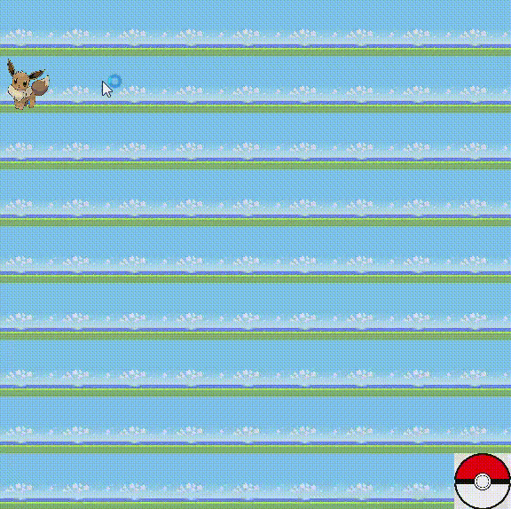

<h1 align="center">

Sketch Pokemon 👾 
 
  </h1>

  ## 📕 About

  #### **Sketch pokemon** é um mini-game, feito em *JavaScript*, com alguns elementos de *CSS* e *HTML*.  

  ## 🧠 Objetive
  Leve o *Eevvee* até  a pokebola.

  ## 📼 Demo

  

  ## 🔨 Tools

 - [ JavaScript](https://developer.mozilla.org/en-US/docs/Web/JavaScript)

 - [CSS](https://developer.mozilla.org/pt-BR/docs/Web/CSS)
 - [HTML](https://developer.mozilla.org/pt-BR/docs/Web/HTML)